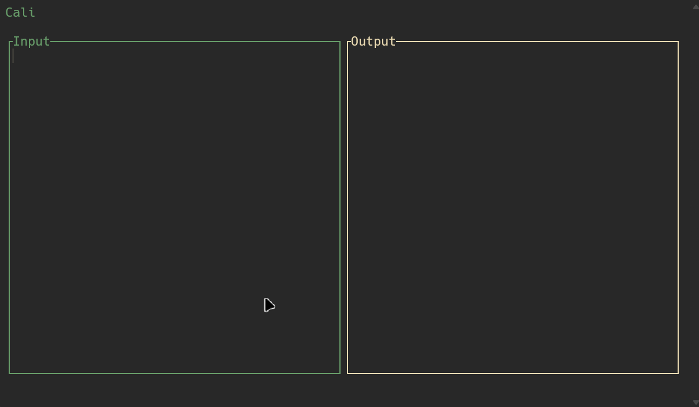

# Cali

Cali is a terminal-based calculator that allows you to perform calculations using natural language expressions. It supports various features like unit conversions, date calculations, and real-time evaluation.



## Installation

### Prerequisites

- Rust and Cargo (1.56.0 or newer)

### Building from Source

1. Clone the repository:
   ```bash
   git clone https://github.com/BorhanSaflo/cali.git
   cd cali
   ```

2. Build with Cargo:
   ```bash
   cargo build --release
   ```

3. The compiled binary will be available at `target/release/cali`

### Installing the Binary

```bash
cargo install --path .
```

## Usage

### Basic Operations

Start Cali by running:

```bash
./target/release/cali
# Or if installed with cargo install
cali
```

Type expressions and see results instantly:

```
10 + 5          # 15
20 * 3          # 60
100 / 4         # 25
```

### Variables

Assign values to variables and use them in calculations:

```
price = 10 USD
tax = 7%
total = price + price * tax   # $10.70
```

### Unit Conversions

Convert between various units:

```
5 km in miles        # 3.10686 mi
10 USD in EUR        # €8.50
350 ml in cups       # 1.47981 cup
```

### Date Calculations

Perform date-related calculations:

```
next friday          # 2025-04-18
next monday + 2 weeks  # 2025-05-05
```

### Percentages

Calculate percentages:

```
20% of 50           # 10
price - 15%         # $8.50
```

## Keyboard Shortcuts

- `Enter`: Add a new line
- `Up/Down`: Navigate through lines
- `Left/Right`: Move cursor horizontally
- `Home/End`: Move to start/end of line
- `Backspace/Delete`: Delete characters
- `Ctrl+q`: Quit the application

## License

[MIT License](LICENSE)
